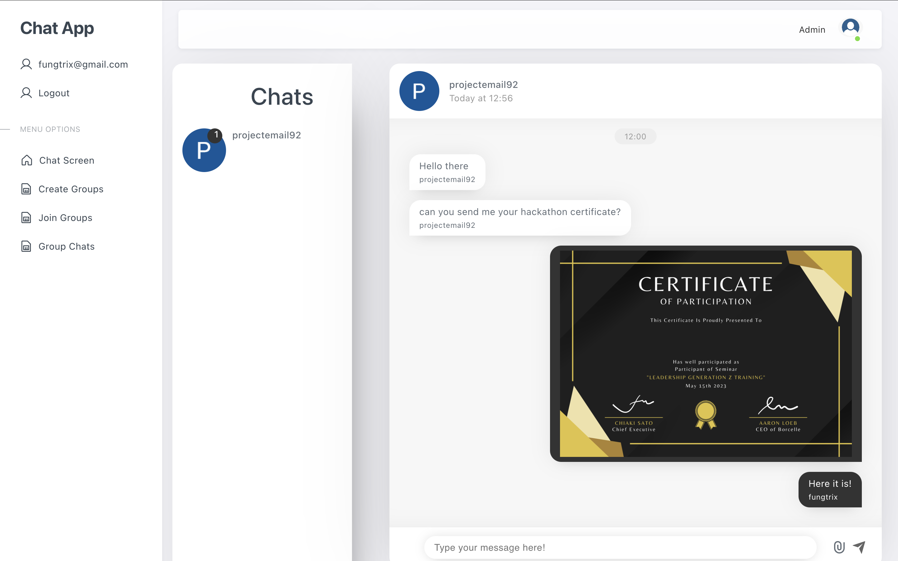
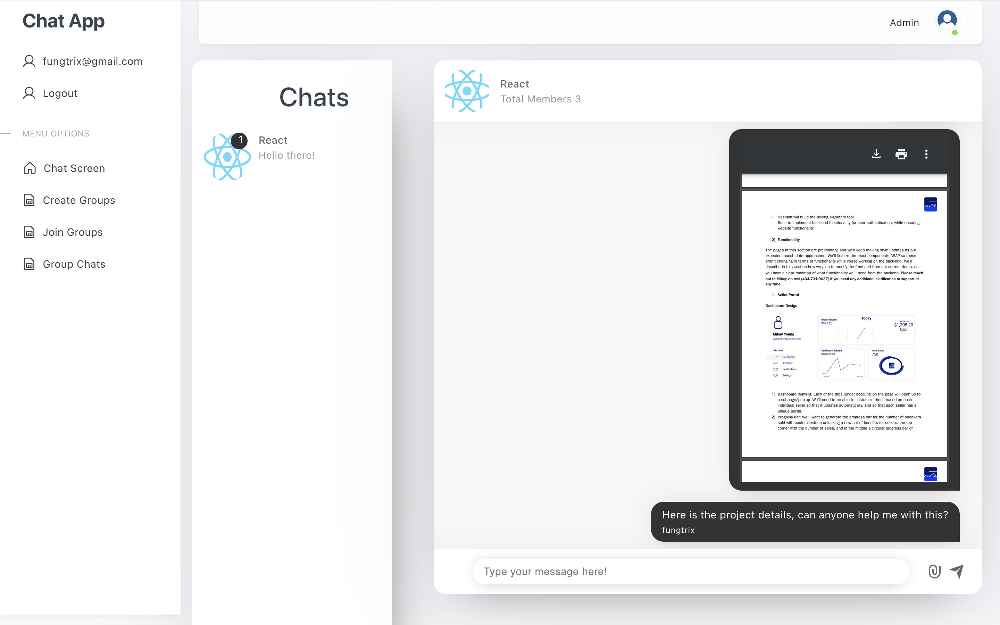

# Project Title - Realtime Chat App

# Features:

1. Google User Authentication: Users can be able to log in and log out using their Google accounts via Firebase Authentication.

2. Chat Rooms: Users should be able to create, join, and leave chat rooms.

3. Real-Time Messaging: Messages sent by users should appear in the chat room in real time.

4. Message History: The chat application should store the history of messages for each chat room, which should be visible to users when they join the room.

5. Share File: It allows users to upload and share various types of files, including images and PDFs using Pinata.

6. Private Messaging: Users should be able to send private messages to other users.

# Tech Stack

- React JS
- Pinata
- Firebase Firestore
- Firebase Realtime database
- Firebase Authentication

## Screenshots

|  |  |  |  |
| :------------------: | :-----------------------: | :-------------------: | :---------------------: |
|     Chat Screen      |       Create Group        |      Group Chat       |       Join Group        |

| 
| :-------------: |
| Login Page
